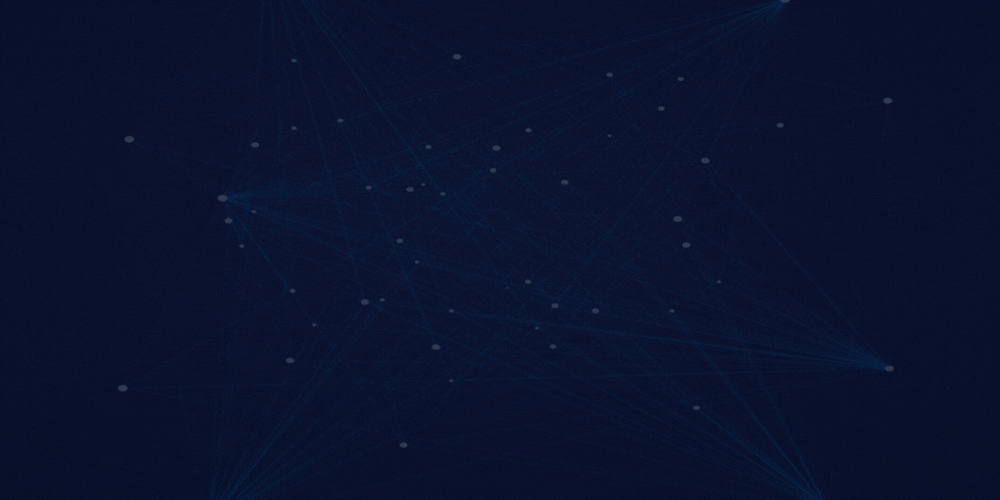
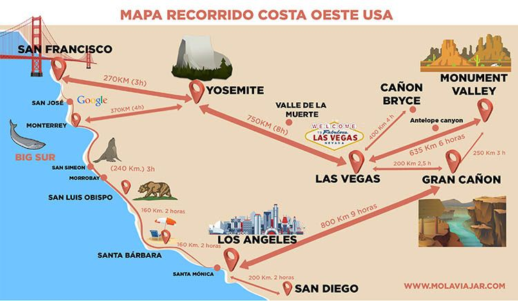

# <h1 align=center>**`Millennium Insights Data (MID)`**</h1>

-------

Somos una empresa consultora de datos enfocada en transformar sus datos en información para que ustedes puedan usarla para tomar futuras decisiones e inversiones. Buscamos que se sientan cómodos y seguros, nuestra identidad se basa en la confianza que nos proporcionan. En esta ocasión fuimos contratado por la cadena hotelera latinoamericana GHL, como parte integral del equipo estratégico que busca expandir la cadena hacia los Estados Unidos. 

## 📌 Costa Oeste de EEUU
La costa oeste de los Estados Unidos es uno de los destino turístico de mayor concurrencia. Conocido por sus impresionantes paisajes naturales, su historia, cultura y su vibrante vida nocturna. El sector hotelero y turístico de la región son un importante motor económico, que genera millones de dólares en ingresos y crea miles de puestos de trabajo.

En los últimos años, el sector hotelero y turístico de la costa oeste ha experimentado un crecimiento positivo. En 2022, la región recibió un récord de 150 millones de visitantes, lo que supuso un aumento del 10% respecto al año anterior. Este crecimiento se debe a una serie de factores, entre los que se incluyen:

- El aumento de la demanda de viajes internacionales
- La creciente popularidad de las vacaciones en la naturaleza
- La expansión de las aerolíneas low cost
  
El sector hotelero y turístico de la costa oeste es un sector importante y en crecimiento.Desempeña un papel importante en la economía de la región debido a que es una de las principales razones del crecimiento es el aumento de la demanda de viajes internacionales. Es un destino popular para los viajeros de todo el mundo, estos son atraídos por la amplia actividades que posee, por ejemplo, las actividades al aire libre (senderismo, ciclismo, surf, pesca, entre muchos otros).

### 📌 Las reseñas de hoteles.¿Por qué esto es importante para el sector hotelero?

Las reseñas son una herramienta valiosa para los hoteles ya que pueden ser usadas para mejorar su servicio y satisfacción del cliente:

- Pueden ayudar a los hoteles a identificar áreas de mejora. Las reseñas negativas pueden proporcionar información sobre los problemas que los clientes están experimentando. Esta información les ayudará a mejorar el servicio, con esto se busca aumentar la probabilidad de que este huesped vuelva. Mejorando la experiencia del cliente genera una fidelidad del mismo.

- Ayuda a los hoteles a promocionarse. Las reseñas positivas pueden atraer nuevos clientes y aumentar las reservas. De esta manera se genera una previa confianza con potenciales clientes. Plataformas como Airbnb, Google Maps, Yelp, y entre otros usan esta modalidad

- Gestionar la reputación de los hoteles. Las reseñas negativas pueden dañar la reputación de un hotel. Los hoteles pueden responder a las reseñas negativas de manera optima y profesional para minimizar el daño a su reputación.

## 📌 Propuesta

Como se mencionó anteriormente, nuestro alcance será la costa oeste de EEUU. Se analizará y procesará información extraida de las plataformas de Google y Yelp que serán usadas como apoyo para el proceso de la toma de decisiones. Se realizará un análisis de datos donde usaremos las reseñas de los clientes y usuarios de los diferentes negocios comerciales, con estas reseñas haremos un sistema de recomendación para usuarios donde al usuario le muestre los locales más cercanos de donde se encuentra su hotel y un top de hoteles con mejores reseñas. Esto se encontrará en una aplicación. Para más información consulte nuestro [wiki](https://github.com/ConsultoraAnalisisDeMercado/PF_CONSULTORA_MID/wiki) ubicado en la parte superior de este repositorio, también se presentará la estructura de este en la parte inferior del readme.

## 📌 Estructura del repositorio

**[Projectos](https://github.com/ConsultoraAnalisisDeMercado/PF_CONSULTORA_MID/projects)** Gestión de los sprints y tareas.  
├─ [Diagrama de Gantt](https://github.com/ConsultoraAnalisisDeMercado/PF_CONSULTORA_MID/wiki/2.Directriz#-diagrama-de-gantt-) 
├─ [Monday](https://github.com/ConsultoraAnalisisDeMercado/PF_CONSULTORA_MID/wiki/2.Directriz#-monday-) 
├─ [GitHub Project](https://github.com/ConsultoraAnalisisDeMercado/PF_CONSULTORA_MID/wiki/2.Directriz#-github-projects-) 

**[Wiki](https://github.com/ConsultoraAnalisisDeMercado/PF_CONSULTORA_MID/wiki)** Acá encontrarán la documentación completa.  
├─ [Directriz](https://github.com/ConsultoraAnalisisDeMercado/PF_CONSULTORA_MID/wiki/2.Directriz) 
├─ [Resumen Ejecutivo](https://github.com/ConsultoraAnalisisDeMercado/PF_CONSULTORA_MID/wiki/3.Resumen-Ejecutivo) 
├─ [Informe Técnico](https://github.com/ConsultoraAnalisisDeMercado/PF_CONSULTORA_MID/wiki/4.Informe-T%C3%A9cnico) 
├─ [Feedback de los contribuidores](https://github.com/ConsultoraAnalisisDeMercado/PF_CONSULTORA_MID/wiki/5.Feedback-de-los-contribuidores) 
 

## 📌Tecnologías usadas

El proyecto hace uso de diversas tecnologías y herramientas para realizar un análisis exhaustivo. Algunas de las principales tecnologías utilizadas fueron:

 

